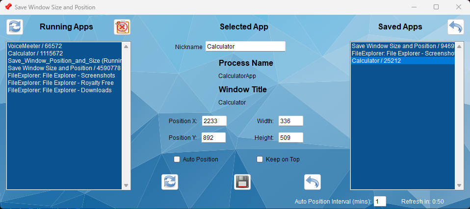

# Save Window Position and Size

A Windows utility that saves and restores window positions and sizes for your applications.

## Overview

This application allows you to:
- Save window positions and sizes for any application
- Automatically restore windows to their saved positions
- Manage multiple window layout profiles
- Keep important windows always on top
- Visually highlight windows for easy identification

## Main Features

### Profiles
The application supports multiple profiles, allowing you to save different window layouts for different scenarios. Select a profile from the dropdown menu in the top-right corner.

### System Tray Icon
The application minimizes to the system tray. Double-click the tray icon to show/hide the main window. Right-click for additional options:
- Show GUI - Opens the main interface
- Start/Stop Auto Moving - Enables/disables automatic window positioning
- Capture Current Layout - Saves all current window positions to the active profile
- Switch Profile - Quickly change between saved profiles
- Exit - Closes the application

### Running Apps List
Shows all currently running applications. Select an app to view or edit its position and size settings.

### Saved Apps List
Shows all applications saved in the current profile. Select a saved app to view or edit its settings.

## UI Elements and Controls

### Window Management Buttons
- **Refresh All Apps** (↻) - Updates the list of running applications
- **Ignore List** (🚫) - Opens the ignore list manager
- **Refresh Window** (↻) - Updates the selected window's current position and size
- **Save** (💾) - Saves the current window settings to the active profile
- **Restore** (↔️) - Restores the selected window to its saved position and size
- **Restore All** (↔️) - Restores all saved windows in the active profile

### Window Properties
- **Nickname** - Custom display name for the window
- **Position X/Y** - Window's screen coordinates
- **Width/Height** - Window's dimensions
- **Auto Position** - When checked, automatically restores this window's position periodically
- **Keep on Top** - When checked, keeps the window always on top of other windows
- **Use Percentages** - When checked, uses percentage values instead of pixels for position and size
  > **⚠️ Note:** The Use Percentages feature is experimental and not fully working yet. Use with caution.

### Global Settings
- **Auto Position Interval** - How often (in minutes) the application checks and restores window positions
- **Skip confirmation dialogs** - When checked, certain operations will proceed without confirmation prompts

## How to Use

### Saving Window Positions
1. Arrange your windows as desired on your screen
2. Click the Refresh All Apps button to update the running apps list
3. Select the app you want to save from the list
4. The app details will populate in the middle section
5. Adjust settings if needed (position, size, nickname, etc.)
6. Click the Save button to save the window to the current profile
7. Repeat for all windows you want to save

### Quick Capture All Windows
Use the "Capture Current Layout" option in the system tray menu to quickly save all visible windows to the current profile.

### Restoring Windows
- Select a saved app and click the Restore button to restore just that window
- Click the Restore All button to restore all saved windows in the current profile
- Enable Auto Position for windows you want automatically maintained at their saved positions

### Removing a Saved Window
Select a saved app in the Saved Apps list and press the Delete key to remove it from the profile.

### Using the Ignore List
Add applications to the ignore list if:
- They appear in the running apps list but don't have visible windows
- You don't want them to be affected by the automatic positioning feature

You can add apps to the ignore list by right-clicking an app in the Running Apps list and selecting "Ignore".

### Window Highlighting
When you select a window from either list, the application will briefly highlight it with a red border to help you identify it on screen.
